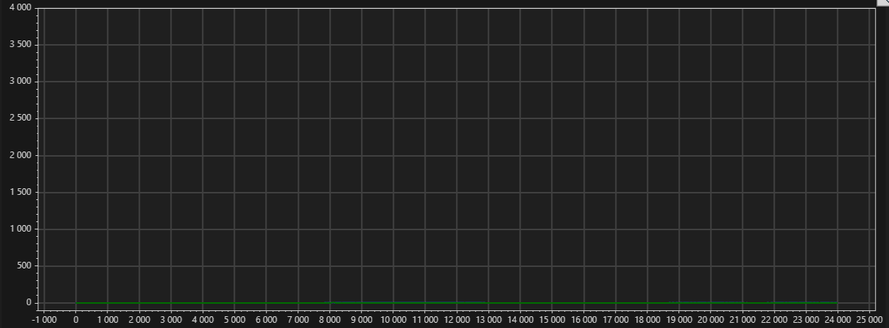

# PowerScope
A tool for plotting and analyzing data from embedded targets like MCUs and FPGAs.
"See" with the eye of your embedded system.

 

__Key features:__
- Real-time plotting of high-speed serial data (3MBaud and above)
- Lightweight data protocol for efficient data transfer
- Supports data from multiple devices simultaneously
- Data analytics:
  - Min/max/average calculations
  - Filtering of incoming data in real-time
  - Large data set handling. Recording depth only limited by available RAM.

[?? User Guide](UserGuide.md)

## Philosophy
- Targeted application: Plotting of high-speed data for development and degugging.
- Functionality limited. Similar to modern oscilloscopes. There are other tools for that.
- Built for engineers in the field of control engineering, power electronics and robotics.
- Currently Windows 10 / 11 only. 

