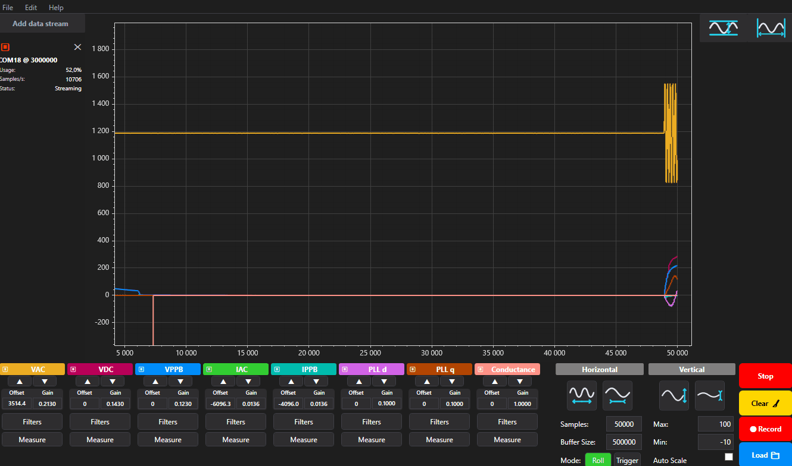

# PowerScope
A tool for plotting and analyzing data from an embedded device.
Specifically designed for use in power electronics and control engineers.

 

__Key features:__
- Real-time plotting of high-speed serial data (3MBau and above)
- Lightweight data protocol for efficient data transfer
- Supports data from multiple devices simultaneously
- Data analytics:
  - Min/max/average calculations
  - Filtering of incoming data in real-time
  - Large data set handling. Recording depth only limited by available RAM.

 

  ## Philosophy
PowerScope was developed for engineers in the area of control engineering and power electronics.
"Seeing" with the eyes of the embedded controller is crucial for understanding and debugging complex systems.
Many other tools only allow a pre-defined Baud rate (e.g. 115200) which is often too slow for high-speed applications.
